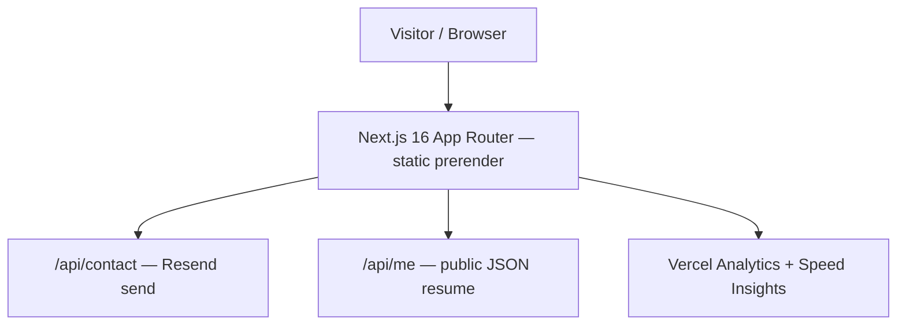

# System Architecture — chaitanyaparasana.com

A single-page, heavily-animated developer portfolio (the "FIELD" design) whose content is
plain, crawlable, semantic HTML. Live at `https://www.chaitanyaparasana.com`.

## 1. Frontend — the FIELD engine (ADR-0006)
- **Framework**: Next.js 16 (App Router), React 19 (ADR-0003). The page is a `"use client"`
  component but is statically prerendered; the HTML ships with all content.
- **Motion**: one `requestAnimationFrame` loop drives a transformed scroll stage
  (wheel / touch / keyboard — no native scroll, no Lenis). Reveals, counters, and the
  chapter curtain are CSS transitions + imperative style writes. No Three.js, GSAP, or
  framer-motion.
- **Background**: a 2D `<canvas>` particle "field" (6 formations, mouse repulsion), DPR-capped,
  `aria-hidden` — decorative only.
- **Styling**: hand-written CSS custom properties in `globals.css` ("Bone paper & wine"
  palette, `clamp()` + auto-fit, radius 0). No Tailwind.
- **Structure**: `src/components/field/` — `data.ts` (copy + links), `canvas.ts` (field),
  `chapters.tsx` (6 chapters + reveal/expand/form), `Field.tsx` (engine),
  `MobileChapterBar.tsx` (bottom nav ≤720px).

## 2. Backend — none; direct Resend (ADR-0007, supersedes Convex ADR-0002)
- No database. The contact form posts to `src/app/api/contact/route.ts`, a Next Route
  Handler that sends email via **Resend** (init inside the handler, ADR-0005).
- Guards: honeypot, input validation, HTML escaping, newline-stripped name, in-memory IP
  rate limit (5 / 10 min). Reflects the real send result to the user.

## 3. Rendering & SEO (ADR-0008)
- Content is static semantic HTML; one `<h1>` (hero), an `<h2>` per chapter, `<h3>` items;
  nav is real `<a href="#…">` (always-rendered mobile bar).
- Metadata / canonical / OG / Twitter / Person JSON-LD / robots / sitemap all derive from
  `src/lib/site.ts` (canonical `https://www.chaitanyaparasana.com`).
- App-served: `/robots.txt`, `/sitemap.xml`, `/opengraph-image` (dynamic card),
  `not-found`, `icon.svg` + `apple-icon` (open-C favicon).
- Google + Bing verified via meta tags. Vercel Analytics + Speed Insights for field data.

## 4. Deployment
- Vercel, connected to the GitHub repo (push to `main` → production deploy).
- `vercel.json` uses the framework default build. Env: `RESEND_API_KEY` (required),
  optional `NEXT_PUBLIC_APP_URL` (overrides the canonical default).
- Domain bought at Spaceship; `www` primary, apex 308 → `www`, HTTPS via Vercel.
- A multi-stage `Dockerfile` + Kubernetes manifests exist (ADR-0004) but Vercel is the
  live target.

## 5. Public endpoints
- `/api/me` — structured JSON resume (fed by `src/lib/portfolio-data.ts`).
- `/api/health` — liveness/readiness probe.
- `/api/contact` — the Resend contact handler.

## 6. Data flow

