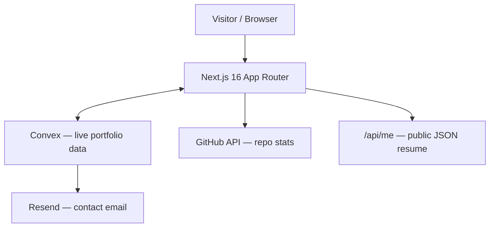

# STATE — <!-- updated: 2026-08-28 -->

## Current focus
Rebuilding the portfolio as a futuristic, continuous 3D-scroll experience — a
single scroll-driven journey where 3D objects (React Three Fiber) move with the
page, tied together by Lenis smooth scroll and GSAP. Strictly anti-slop,
responsive across phone/desktop/iPad.

## Shape

## Done
- Ported fresh content from the `studioportfolio` repo (AI Studio regen) into
  `src/lib/portfolio-data.ts`: 4 real projects (k8s GitOps, Vellum, ScoreDay,
  orient), 3 upcoming (MonFlow, JobAutomator, Edge SLM Agent), new bio. Kept real
  email/socials (no X account); design intentionally NOT copied (it was slop)
- Removed the dead Convex "RAG" (getResponse + seed.ts + documents/messages
  tables); Convex now does one job: the contact form (submitInquiry + Resend)
- Ripped out the unused shadcn/ui kit: 46 `src/components/ui/*` files (~4,200
  lines) + 36 exclusive deps (26 @radix-ui, recharts, react-hook-form, vaul, cva,
  etc.). Dependencies 55 → 25. Re-add per-component during the redesign if needed
- Contact/inquiry form with input guardrails, sends via Resend
- CI/CD industrialized: multi-stage Docker, Kubernetes manifests, GitHub Actions
- Public `/api/me` JSON endpoint + `/api/health` probe

## In progress
- Direction locked: futuristic continuous 3D-scroll design (3 exploratory sketches
  published earlier to a Claude Design canvas informed it)
- 3D/motion toolchain installed (three, @react-three/fiber, @react-three/drei,
  gsap, lenis, tweakpane)

## Next up
- Wire Lenis + GSAP ScrollTrigger + drei ScrollControls into one scroll timeline
- Build the scroll journey and 3D scenes across phone/desktop/iPad breakpoints

## Blocked / needs research
- None open — ready to build

## Known issues
- Current live design leans on banned AI-slop patterns (amber gradient, glass,
  lucide/sparkle icons, grid background) — slated for removal in the redesign
