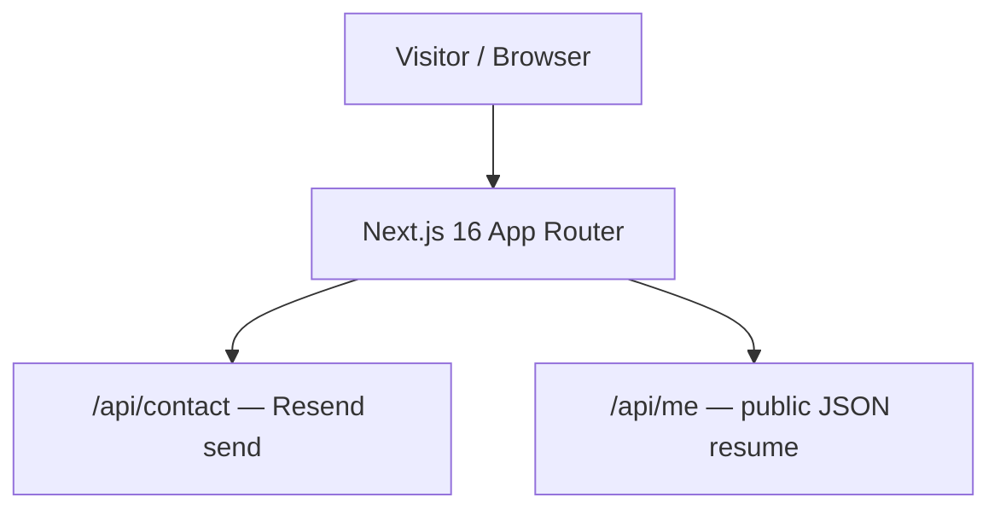

# STATE — <!-- updated: 2026-09-05 -->

## Current focus
The **FIELD** portfolio: a single fixed-viewport, six-chapter site on a custom
smooth-scroll stage, a 2D-canvas particle "field" behind everything, and a wine
curtain between chapters. Palette "Bone paper & wine". No Three.js on the page.

## Shape

## Done
- **FIELD build + exact-source reconciliation** (from `design_handoff_portfolio_field/`;
  the `.dc.html` is source of truth): `field/{data,canvas,chapters,Field}.tsx` + full
  `globals.css`. rAF scroll engine (wheel/touch/keys), particle field (6 formations,
  "Nodes and threads"), scroll-window reveals + parallax, counters, branch-draw, curtain
  560/190/720, nav rail, progress rail. Plain CSS, no Tailwind.
- **Old design removed:** deleted the dark/R3F components, content, hooks, data; pruned
  deps (three/R3F, framer-motion, gsap, lenis, next-themes, tailwind, shadcn kit). Kept
  `src/lib/portfolio-data.ts` (feeds `/api/me`).
- **Build 01 — cursor / first load / transitions:** ring+dot+label cursor (4 states,
  hidden on touch), eased preloader (1500/500ms), `navigate()` curtain with spam-guard +
  keyboard 1–5/Esc + hash sync; reload on `/#work` inits without a curtain.
- **Build 02 — element specs** (`BUILD-02-elements.md`, 9 sections): fixed the work-panel
  scroll bug (`trackPanel` re-measures range per frame → settles `height:auto`);
  plain-words Work copy; header keyhint+ticker+blink (dropped "Open to work"); hero /
  About / nav-rail spacing; open-C arc monogram.
- **Build 03 — mobile chapter bar:** `MobileChapterBar.tsx`, bottom-fixed 6 cells at
  `≤720px` (rail hidden), sliding indicator via `ResizeObserver`, 56px targets, safe-area
  padding, `.fld-chapter` bottom clearance.
- **Backend simplified to Resend:** removed Convex entirely; `/api/contact` sends the mail
  directly (honeypot + validation, escaped HTML, `replyTo` sender). Dropped `convex`/`zod`
  deps; `vercel.json` back to framework default. Stripped stale Convex notes from
  CLAUDE.md / AGENTS.md.
- **SEO / crawlability / security:** full metadata in `layout.tsx` (title, description,
  canonical, robots index/follow, Open Graph, Twitter card, `metadataBase`) + Person
  JSON-LD; `app/robots.ts` → `/robots.txt`, `app/sitemap.ts` → `/sitemap.xml`,
  `app/opengraph-image.tsx` (dynamic bone-&-wine social card), branded `not-found.tsx`.
  URLs centralised in `src/lib/site.ts`. Every chapter now has an `<h2>` (one `<h1>` =
  hero, `aria-label`led); nav chapter links are real `<a href="#…">` (mobile bar, always
  in DOM); content is static-prerendered semantic HTML, canvas is `aria-hidden`.
  Contact route: IP rate limit (5/10min, in-memory) + newline-stripped name + escaped
  HTML. Verified live: robots/sitemap/OG 200, metadata + JSON-LD present, 6th POST → 429.
- **Launched on the custom domain:** live at `https://www.chaitanyaparasana.com` (bought
  at Spaceship; `www` primary, apex 308→www, HTTPS). Canonical/OG/sitemap point to www via
  `NEXT_PUBLIC_APP_URL` + the `site.ts` default. Google + Bing verified (meta tags),
  sitemap submitted, indexing requested. Vercel Analytics + Speed Insights on. Branded
  open-C favicon (`icon.svg` + `apple-icon`, bone bg), OG description trimmed to 141/113
  chars. Lighthouse: Accessibility 100 / SEO 100.
- Earlier: CI/CD (Docker, k8s, Actions), `/api/me` + `/api/health`.

## Decisions (docs/decisions/)
0006 FIELD engine · 0007 remove Convex → direct Resend (supersedes 0002) · 0008 SEO /
static-HTML rendering strategy. See `docs/ARCHITECTURE.md` for the current shape.

## Next up
- Supply real work screenshots (placeholder "…shot, drop image" frames) + hover-card art;
  add `alt` text when real ``s land.

## Blocked / needs research
- None open.

## Known issues
- None open.
